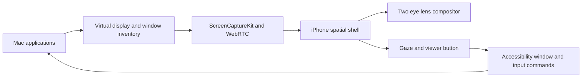

# VisionOS-inspired roadmap

MACLand's target is a polished virtual Mac space on inexpensive phone VR hardware. The user looks around by rotating their head; a reticle fixed at the center of view selects items through a viewer button or dwell. The space is virtual and rotationally head-tracked. Eye tracking, hand tracking, passthrough, and room-scale position tracking are out of scope.

## Current architecture

## Delivery stages

| Stage | State | Exit criteria |
| --- | --- | --- |
| Secure Mac session | Implemented, hardware validation pending | Pinned TLS pairing, reconnect, bidirectional ICE, video and input survive a 30-minute LAN session |
| Spatial shell | Implemented | Persistent environment, world-anchored desktop, dock, launcher, window switcher, display controls |
| Headset input | Implemented, tuning pending | A head-centered reticle, viewer button, and configurable dwell activate every primary action without removing the phone |
| Optical comfort | In progress | GPU pre-warp ships now; Cardboard viewer QR scanning supplies the final per-eye mesh and projection |
| Independent windows | Next major milestone | Each selected Mac window has its own stream, transform, focus state, depth, and close/minimize controls |
| Media completeness | Planned | Mac system audio is synchronized with video; adaptive bitrate keeps motion-to-photon latency stable |
| Onboarding | Planned | Camera QR pairing, TLS identity creation, permission checks, viewer calibration, and a first-run comfort test |

## Near-term implementation order

1. Add a Cardboard SDK bridge for QR viewer parameters, per-eye projection, and distortion meshes.
2. Split ScreenCaptureKit capture by `SCWindow` and negotiate one WebRTC video track per visible spatial panel.
3. Add panel grab, move, resize, depth, pin, and restore operations driven by head direction plus a Bluetooth or viewer trigger.
4. Publish the existing ScreenCaptureKit audio samples as a synchronized WebRTC audio track.
5. Replace pasted pairing JSON with camera pairing and automatic local TLS identity setup.
6. Measure glass-to-glass latency and frame pacing on physical devices, then tune resolution and bitrate profiles.

## Definition of “near visionOS” for this project

The target release should let a user put the phone in a compatible viewer, connect to a Mac, look around a virtual environment, launch an app, arrange multiple windows, click, type, hear audio, recenter, and reconnect without touching developer settings. The center reticle follows head rotation; the user selects with the viewer button or dwell. The space does not need eye, hand, or room tracking. It should hold a stable frame rate and remain comfortable for a normal desktop session.
